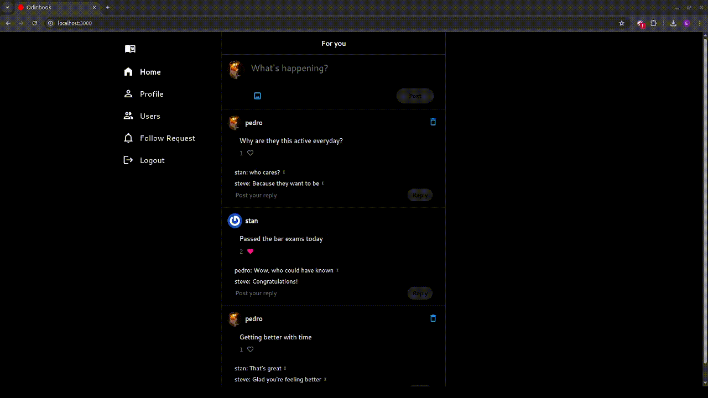

# Odinbook
A a Full Stack Social Media clone

## Features
- Sign In
- Sign Up with email or google authentication
- Send follow requests to other users
- Accept or deny follow requests
- Create polymorphic posts (image or text)
- Like and comment on posts
- Display post author, content, likes, comments
- Display collection of own posts and followed users posts
- View of user profile with user information and an index of that users posts
- Index page for all users
- Deployment on Render
- Send welcome email to new users

### Turbo Frames navigation
- Uses turbo_frames to avoid a full page reload on:
    - Page navigation
    - Edit profile

### Dynamic page update
- Uses turbo_stream and websocket to dynamically update pages on link clicks
    - Broadcasts post creation and deletion to self and followers
    - Broadcasts comment creation and deletion
    - Broadcasts likes creation and deletion
    - Broadcasts follow requests creation(request), deletion(deny), and update(accept)
- Uses stimulus to dynamically update forms and navigation
    - Updates navigation link based on current page
    - Updates post form based on type of post
        - Disables input when image is uploaded
        - Disables submit when text input is empty or no file uploaded
    - Updates profile links based on current page

### Extra credit polymorphic posts
- Posts can either be a text or an image
    - Post model uses a polymorphic association to either a Text or Picture model

### Design 
- Main inspiration for the design was X formerly known as twitter

## Tech Stack 
- Rails
- Postgres
- Turbo
- Stimulus
- HTML
- CSS
- JavaScript

## Showcase

## Test the app with these login credentials
- usernames
    - pedro
    - steve
    - stan
- password for these accounts
    - 1234Aa*&

Currently live on render as of November 4, 2025:
https://mysite-qfw4.onrender.com/users/sign_in

This is the final project for the Rails course in The Odin Project: 
https://www.theodinproject.com/lessons/ruby-on-rails-rails-final-project
